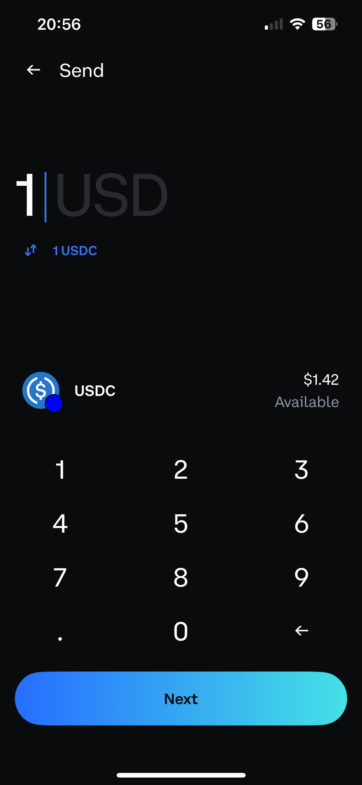
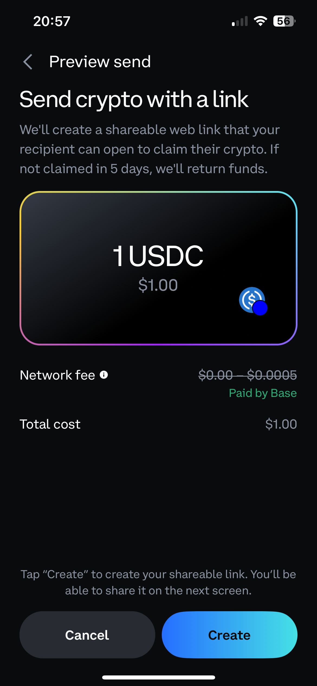
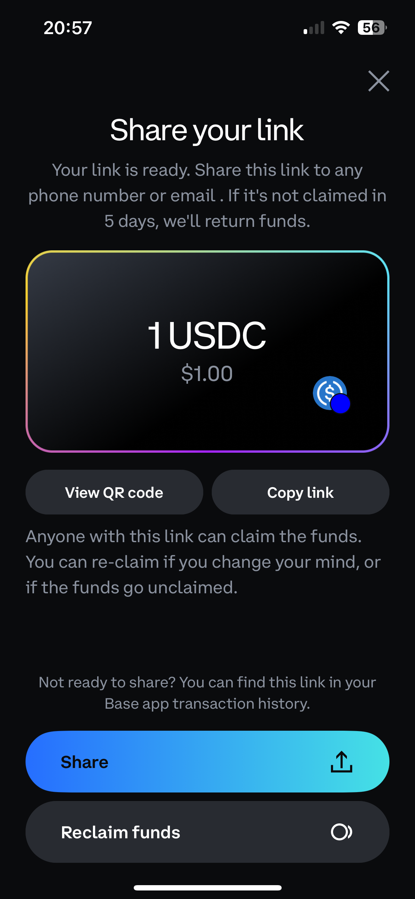
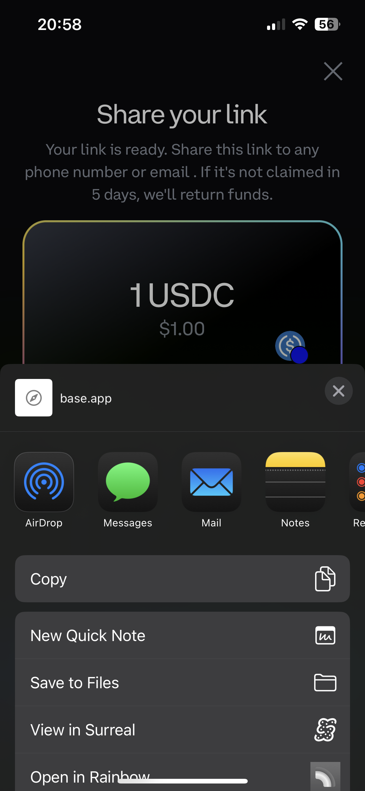
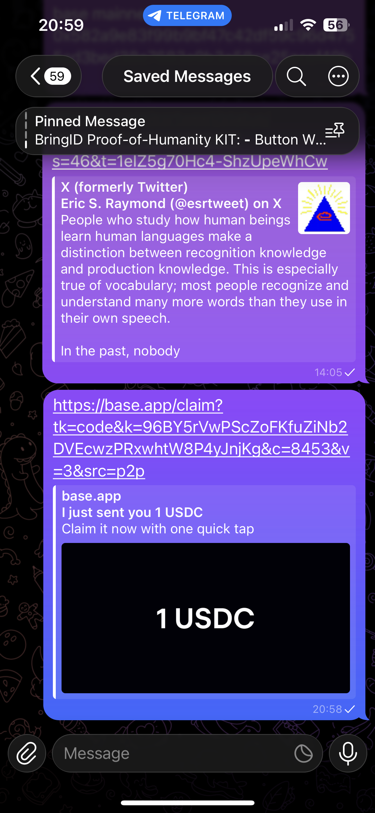
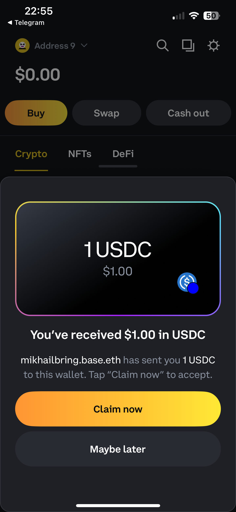
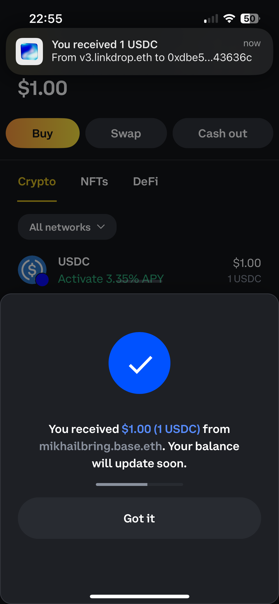
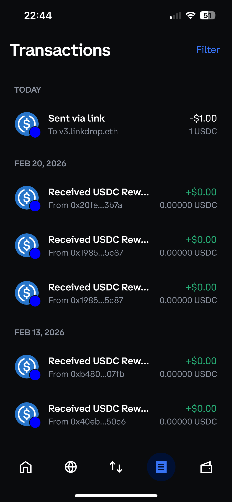
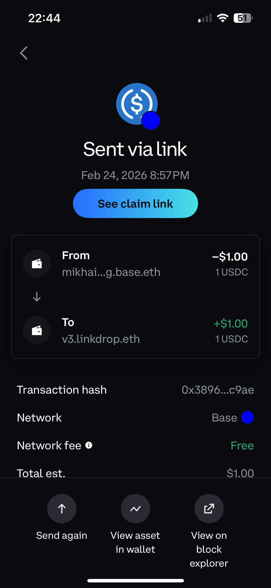

# Linkdrop — Wallet Integration Overview

## What is Linkdrop?

Linkdrop enables sending crypto tokens via shareable URLs (claim links). A sender deposits tokens into an escrow smart contract and generates a claim link. The recipient opens the link and redeems tokens to their wallet.

**Supported tokens:** Native tokens (ETH, MATIC, AVAX, etc.), ERC20, ERC721, ERC1155  
**Supported chains:** Base, Polygon, Optimism, Arbitrum, Avalanche (additional EVM chains can be added within days on request)

---

## What Linkdrop Provides

| Component | Description |
|-----------|-------------|
| **Backend infrastructure** | Fully hosted by Linkdrop, the wallet does not need to deploy or maintain any servers |
| **Escrow smart contracts** | Onchain contracts handling token distribution from senders to recipients |
| **SDK** | Client-side library the wallet integrates to create and redeem claim links |
| **Relayers** | Linkdrop sponsors all claim transactions, recipients don't pay gas and don't need to have any crypto to claim a link |
| **Dashboard (Web UI)** | Web interface at [dashboard.linkdrop.io](https://dashboard.linkdrop.io) for businesses to create claim links in bulk |

### SDK Availability

| Language | Status |
|----------|--------|
| TypeScript | Available — [linkdrop-sdk on npm](https://www.npmjs.com/package/linkdrop-sdk) (latest: 3.15.2-beta) |
| Go | Available |
| Swift (iOS) | Can be ported on request (~1 month) |
| Kotlin (Android) | Can be ported on request (~1 month) |

### Fees

- **Integration is free for wallets.** There are no costs to integrate or use the P2P send-via-link feature.
- Linkdrop plans to charge fees only to Dashboard (B2B) users who create bulk claim links via the web UI.

---

## Link Creation Modes

There are two independent modes. Wallets can support both or just one.

### Mode 1: P2P Links (Send-via-Link)

A wallet user sends tokens to anyone by creating a shareable link. Each link has its own deposit transaction.

**Who creates links:** End users, directly in the wallet app.

**Sender flow:**

 1. User opens "Send via Link"                                   
 2. Selects token, chain, and enters amount                      
 3. Optionally adds a message (encrypted, max 140 chars)         
 4. Confirms deposit (on-chain tx or gasless signature)          
 5. Receives a claim link URL                                    
 6. Shares the link (messaging apps, share sheet, copy/paste)    

*Screenshots from the Coinbase Wallet integration:*

| Select token & amount | Confirm deposit | Share link |
|:---:|:---:|:---:|
|  |  |  |

| OS share sheet | Link preview in Telegram |
|:---:|:---:|
|  |  |

**Recipient flow:**

1. Opens claim link (deep link / universal link into the app)   
2. Sees token, amount, chain, sender, and optional message      
3. Taps "Claim" → tokens are sent to their wallet address       

| Claim screen | Success |
|:---:|:---:|
|  |  |

**Accessing claim link from the transaction history screen:**
| Transaction history | Transaction details |
|:---:|:---:|
|  |  |

### Mode 2: Dashboard Links (Redeem Only)

Businesses and projects create claim links in bulk via the Linkdrop Dashboard web UI hosted at https://dashboard.linkdrop.io. 
To support Dashboard Links the wallet only needs to implement the redeem side:

**Recipient:**

1. User receives a claim link (email, QR code, social media)    
2. Opens link → deep links into the wallet app                  
3. Sees token, amount, and chain                                
4. Taps "Claim" → tokens are sent to their wallet address       

---

## How It Works (Simplified)

### P2P Flow

```
Sender (wallet user)            Linkdrop                         Receiver
  │                                │                                │
  │  1. Create claim link (SDK)    │                                │
  │ ─────────────────────────────> │                                │
  │                                │                                │
  │                                │                                │
  │  2. Deposit tokens to escrow   │                                │
  │ ─────────────────────────────> │                                │
  │                                │                                │
  │                                │                                │
  │  3. Share URL - ─ ─ ─ ─ ─ ─ - - ─ ─ ─ ─ ─ ─ ─ ─ ─ ─ ─ ─ ─ ─ ─ ─>│
  │                                │                                │
  │                                │  4. Open URL, see link details │
  │                                │ <──────────────────────────────│
  │                                │                                │
  │                                │                                │
  │                                │  5. Claim to wallet address    │
  │                                │ <──────────────────────────────│
  │                                │                                │
```

**Link statuses**
- *deposited*: tokens locked in escrow, link is claimable
- *redeemed*: receiver claimed the tokens
- *refunded*: sender reclaimed after expiration (default: 15 days)
- *cancelled*: sender cancelled before claim

### Dashboard Flow

```
Business (Dashboard UI)         Linkdrop                         Receiver
  │                                │                                │
  │  1. Create links in bulk       │                                │
  │ ─────────────────────────────> │                                │
  │    ← claim URLs (CSV download) │                                │
  │                                │                                │
  │  2. Approve tx (tokens stay    │                                │
  │     in business's wallet)      │                                │
  │ ─────────────────────────────> │                                │
  │                                │                                │
  │                                │                                │
  │  3. Distribute URLs  ─ ─ ─ ─ ─ ─ ─ ─ ─ ─ ─ ─ ─ ─ ─ ─ ─ ─ ─ - - >│
  │     (emails, QRs, etc.)        │                                │
  │                                │                                │
  │                                │  4. Open URL, see link details │
  │                                │ <──────────────────────────────│
  │                                │                                │
  │                                │                                │
  │                                │  5. Claim to wallet address    │
  │                                │ <──────────────────────────────│
  │                                │                                │
```

Dashboard links arrive already claimable — there is no deposit step to wait for. The SDK returns the same normalized statuses for both link types (`deposited`, `redeemed`, `cancelled`, etc.), so the wallet displays them the same way.

Note: Steps 4–5 (the redeem flow) are identical for both P2P and Dashboard links. The SDK detects the link type automatically, the wallet only needs to build the redeem UI once.

---

## Demos & Screenshots

Screenshots from the Coinbase Wallet integration are embedded in the flow sections above.

**Screen recordings (Coinbase Wallet):**
- [Sender flow](https://www.youtube.com/watch?v=YaVMo_PiQwY) — creating and sharing a claim link
- [Recipient flow](https://www.youtube.com/watch?v=MEUcuJQGLbg) — opening a link and claiming tokens

---

## FAQ

**Do we need to deploy or host anything?**
No. Linkdrop hosts all backend infrastructure. The wallet only integrates the SDK client-side.

**Can we support additional EVM chains?**
Yes. Linkdrop can add support for any EVM chain within a couple of days on request.

**What if the sender loses the claim URL?**
The sender can regenerate it from the wallet (requires a signature). Claim URLs are never stored server-side for p2p flows. 
Dashboard stores claim links in encrypted format. The links can be deciphered by campaign creator. 

**What happens if a link expires unclaimed?**
Links created via SDK (p2p mode) are automatically refunded after expiration (Linkdrop relayer calls the escrow contract to clawback the tokens). 
For links created via Dashboard, token always stay in the campaign creator wallet, there's no need to refund. The links simply don't work after expiration. 

---

## Resources

- **Technical Reference:** [wallet-integration-technical.md](wallet-integration-technical.md) — architecture, security model, SDK code examples, API details
- **SDK repository:** [github.com/LinkdropHQ/linkdrop-sdk](https://github.com/LinkdropHQ/linkdrop-sdk)
- **Demo recordings:**
  - [Sender flow](https://www.youtube.com/watch?v=YaVMo_PiQwY)
  - [Recipient flow](https://www.youtube.com/watch?v=MEUcuJQGLbg)

---

**Contact:** hi@linkdrop.io
